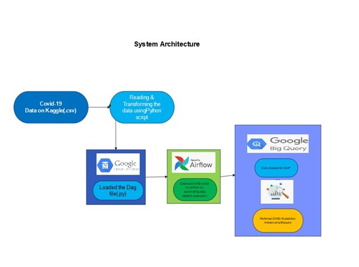
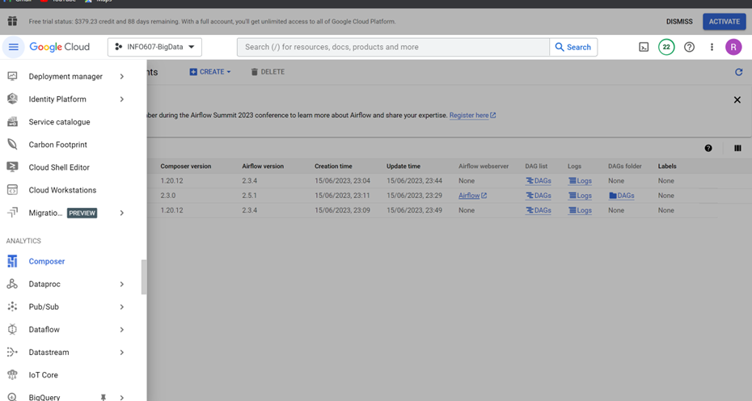
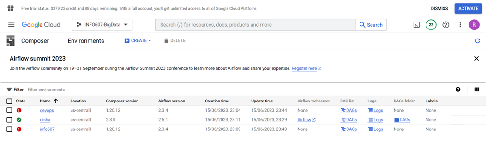
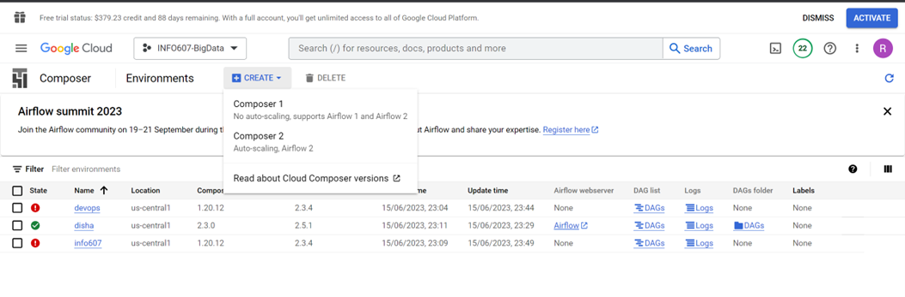
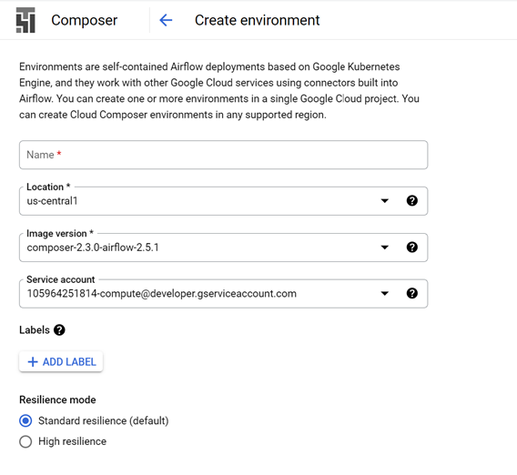
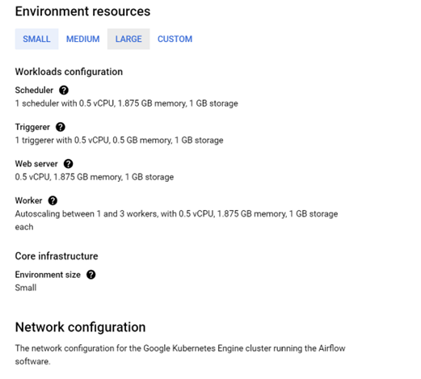
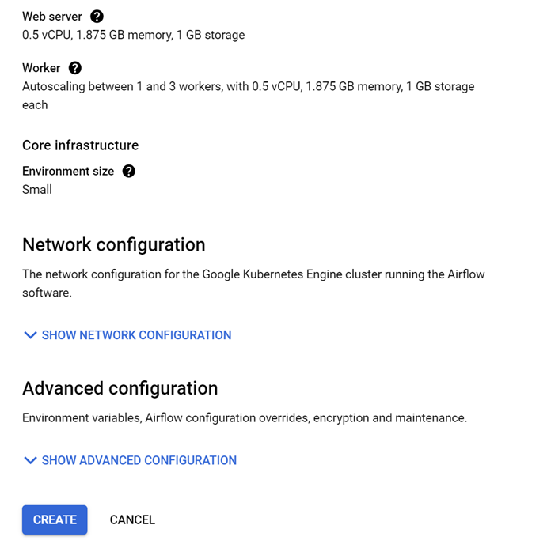
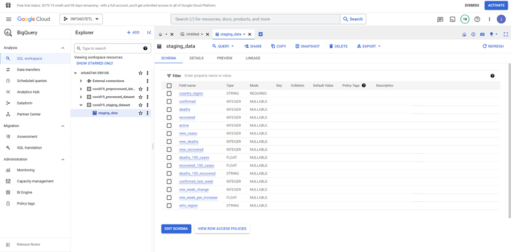
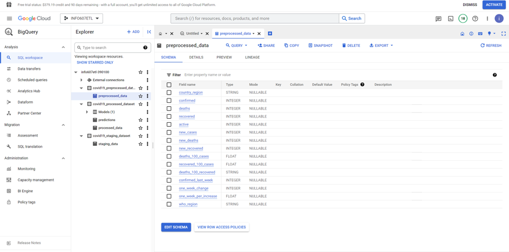
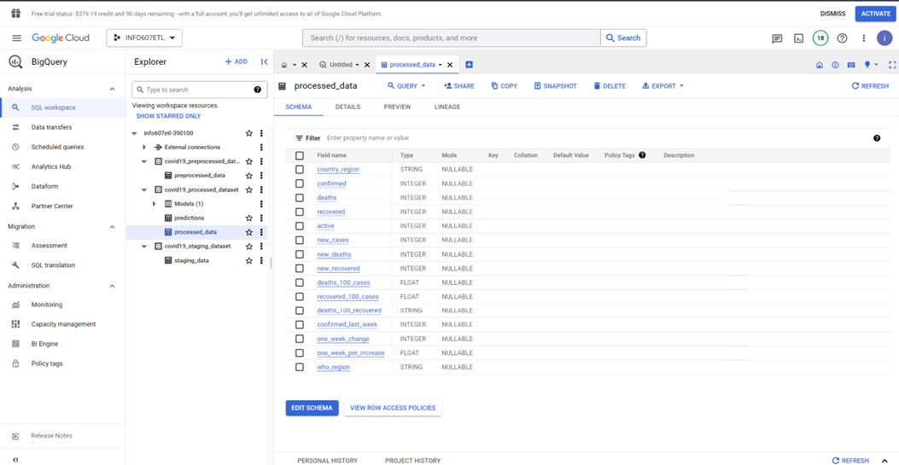

# ETL-Pipelining with Airflow, Google Cloud Storage and BigQuery
Implementing an ETL Pipeline Using Big Query and Airflow for Covid-19 Data


## **Architecture Overview**


## **Data Sources**
1. Kaggle
2. Comma separated values (CSV)
3. Excel (xls, xlsx)
4. JSON

## **Tech Stacks**
1. Python (v3.8.5)
2. Apache Airflow (v2.5.0)
3. Google Cloud Storage (GCS)
4. Google BigQuery
5. Google Composer

## **Installation Setup**
### Setup the Computing Environment
**Step 01: - Go and create a free account on Google Cloud Platform (GCP). Once logged in click on the console it will take you in and post that go to google Composer to setup the environment for the project**



**Step 02: - Once entered into google composer it will look something like this.**



**Step 03: - Post that go to create environment and select Composer 2 with autoscaling option with airflow 2 which provides better performance.**




**Step 04: - Once entered into the creation phase select all the default values for everything and select the smaller environment size and then finally click on create environment.**


**

**Step 05: - Selecting the appropriate environment size**




**Step 06: - Selecting the appropriate network configuration and other defaults and finally create the environment. It takes a while for it to be created so we have to wait a bit but once it creates it has everything, the Airflow, The Webserver and the dag folders to execute the ETL pipeline. Please also find below the reference link for the installation steps:**



**Cloud Composer documentation. (n.d.). Google Cloud. **

https://cloud.google.com/composer/docs

### BigQuery Schema Snapshots

1. Staging Schema:-
 

3. Preprocessed Table Schema:-
 

5. Processed Table Schema:-
 

   


### BigQuery Setup
This project is used some of GCP services which is GCS and BigQuery, and we need to do some stuff on them.
1. On your GCP console, go to BigQuery. You can find it on **Big Data > BigQuery**
2. Then create your Dataset 
3. Fill the Dataset field such as. In this project we only need to set:
   - **Data set ID** (example: my_first_bigquery)
   - **Data location**. Choose the nearest one from your location.
  
   
4. Click `CREATE DATA SET`
5. Ensure that your dataset has been created

<br><br>
### Google Cloud Storage Setup
1. Back to your GCP console, choose Cloud Storage. You can find it on **Storage > Cloud Storage**
2. Click `CREATE BUCKET` button. Then fill some fields such as:
   - Name your bucket (example: blank-space-de-batch1)
   - Choose where to store your data
     - I would suggest to choose **Region** option because it offers lowest latency and single region. But if you want to get high availability you may consider to choose other location type options.
     - Then choose nearest location from you
   - Leave default for the rest of fields.
3. Click `CREATE`
4. Your bucket will be created and showed on GCS Browser
   
<br><br>
### Service Account
To recognized by Google Cloud Platform and interact with them. We have to set our service account.
1. Go to GCP Console again, then navigate to **Products > IAM & Admin > Service Accounts**
2. Click `CREATE SERVICE ACCOUNT` button
3. Fill Service account details by filling `Service account name` and `Service account description` then click `CREATE` 
   <br>Example:
   
4. Click `DONE`
5. Your service account can be seen on the main page
   
6. As you can see this service account doesn't have key yet. Thus we need to create first. On **Action** column click the icon then choose **Manage keys**
7. On Keys page, click `ADD KEY` and choose **Create new key**.
8. Choose `JSON` as the key type then click `CREATE`
9. The key will be automatically created & downloaded to your computer.
  

**Notes**

This `json` key will be needed when adding/editing Airflow Connections later. Thus please keep it safe.

## Airflow Connections
To connect our Airflow with external system, we need to setup connections on Airflow.
1. On http://localhost:8080, go to **Admin > Connections**
2. Add or Edit current Connection. Search for Google Cloud conn type
3. Input fields needed there:
   1. **Conn Id** (example: my_google_cloud_conn_id)
   2. **Conn Type**: Google Cloud
   3. **Description** (example: To interact with Google Cloud Platform such as upload data to GCS, load data from GCS to BigQuery, etc. )
   4. **Keyfile Path**. This path is where your service account key is located. Refer to that path and fill this field with those file path.
   5. **Keyfile JSON**. If you use Keyfile Path, leave this blank
   6. **Number of Retries**. Default value is 5, but I set to 2.
   7. **Project Id**. Set this value to your GCP Project Id.
   8. **Scopes (comma separated)**. People on forum recommends to fill this with https://www.googleapis.com/auth/cloud-platform
   9. Click `Save` button
   10. Done! Everytime your Airflow connector needs `GCP conn_id`, just fill it with your **Conn Id**

Example:


## Airflow Variables
Airflow Variables is very important if you want to set global value which can accessed to your DAGs. Here's how to do it:
1. On http://localhost:8080 go to **Admin > Variables**
2. Click the **Plus (+)** icon. Or you can just Import Variables which is json file containing key value of variables.
3. At very least, this projects must have this Variables:
   1. **BASE_PATH**
   2. **BUCKET_NAME**
   3. **DATASET_ID**
   4. **GOOGLE_CLOUD_CONN_ID**
4. Done! Now your DAGs can access this variable by using:
   ```python
   from airflow.models.variable import Variable
   
   DATASET_ID = Variable.get("DATASET_ID")
   ...
   ```

Example:


## Results
- This is DAGs result of this project


- Stored data on Google Cloud Storage


- The result of loaded table in Data Warehouse which using BigQuery


## How to Use
Everytime you want to run *Native Airflow* on your computer. Do this: 
1. Activate your virtual environment by executing `source venv/bin/activate`
2. Run `airflow webserver --port 8080 ` at your current terminal
3. Run `airflow scheduler` on your other terminal.
4. Go to http://localhost:8080 
